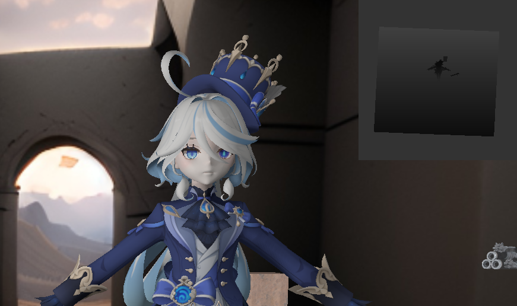

## OpengGL  Real-time Renderer

[B站视频](https://www.bilibili.com/video/BV1MyY4eeEVc/)(虽然这个视频需要更新，里面有些新功能没录上)

### Achieved features

1. Realtime Shadow Mapping with PCF, PCSS(VSSM)
2. Fixed position point Environment mapping with IBL
3. Deferred Rendering Pipeline (include SSAO)
4. PBR shading with PBR textures set.
5. NPR shading
   1. outline
   2. shading (developing)
6. Use assimp to load model with textures.
7. Multiple lights, dynamic lights
8. Control panels, Debug panels, Objects management.
9. Skybox.
10. Postprocessing: Gamma correction, HDR.
11. Free & 360° camera

### Screenshots of Some features

#### 1. Shadows

| Type   | view1                                             | view2                                             |
| ------ | ------------------------------------------------- | ------------------------------------------------- |
| None   |  |  |
| Basic  |  |  |
| PCF K3 |  |  |
| PCF K7 |  |  |
| VSSM   |  |  |

#### 2. Environment Mapping(fixed point)

Scene with IBL

Scene with defualt ambient color

| Env Only      |  |
| ------------- | ------------------------------------------------- |
| Light Only    |  |
| Mirror like 1 |  |
| Mirror like 2 |  |

#### 3. Deferred Rendering

Overveiw

|  |
| ------------------------------------------------- |
|  |

G-buffers

| position              |   depth    |
| ------------------------------------------------------------ | ----------------------------------------------------------- |
|   normal    |   color    |
|   metalness |  roughness |

SSAO-Furina

|            | ssaoRadius:1                                      | ssaoRadius:3                                      |
| ---------- | ------------------------------------------------- | ------------------------------------------------- |
| BlurSize:1 |  |  |
| BlurSize:4 |  |  |

SSAO-Gun

|  |
| ------------------------------------------------- |
|  |

#### 4. NPR shading (outline only)

#### 5. PBR shaders

| Full Term     |  |
| ------------- | ------------------------------------------------- |
| Specular Term |  |
| Diffuse Term  |  |

#### 6. Other features

| Skybox             |  |
| ------------------ | ------------------------------------------------- |
| Normal mode        |  |
| Object Manage      |  |
| Visible Shadow Map |  |

Reference: [learnopengl.com](learnopengl.com), GAMES 202
